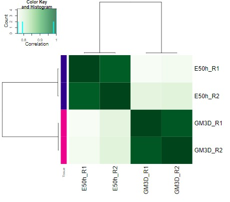
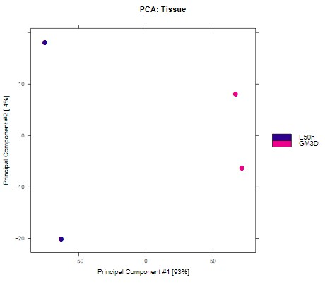
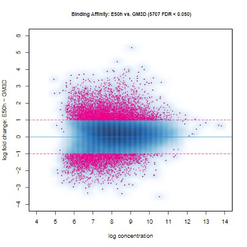
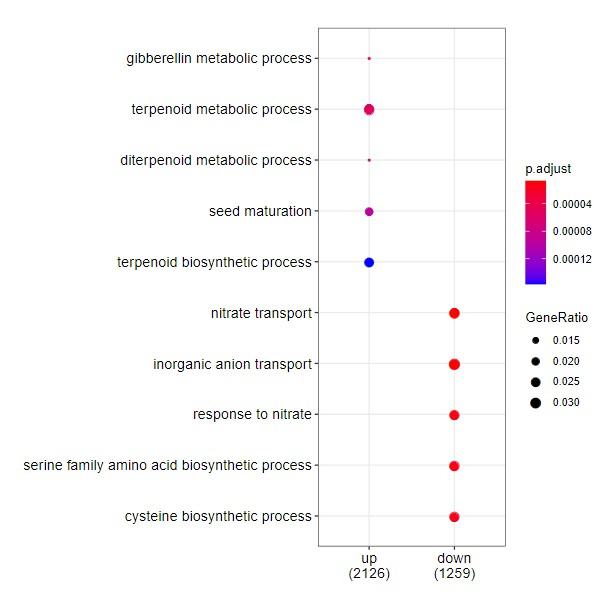

# 2020STARProtocols_pipeline
This is the DownstreamAnalysis script of 2020STARProtocols_pipeline. It will be divided into several parts,  including differential accessibility analysis, enirchment analysis, visualization of result, motif analysis.


## Table of contents

- [Differential_Accessibility_Analysis](#Differential_Accessibility_Analysis)
- [EnrichmentAnalysis](#EnrichmentAnalysis)
- [Visualization](#Visualization)
- [MotifAnalysis](#MotifAnalysis)


## Differential_Accessibility_Analysis

### Preparation

For the differential accessibility (DA) analysis, I make a new R project in the `2020STARProtocols_ATAC_Seq_202010`. Then I create some sub-directory to put correspondent files.

```bash
sgd@localhost ~/project/202010/2020STARProtocols_ATAC_Seq_202010/result/07_Diff
$ mkdir rawdata plot result script


sgd@localhost ~/project/202010/2020STARProtocols_ATAC_Seq_202010/result
$ tree 07_Diff
07_Diff
├── 07_Diff.Rproj
├── plot # put all plot
├── rawdata
│   ├── bam # the symbolic link of bam file
│   └── peak # the symbolic link of peak file
├── result # the analysis result
└── script # put the script of analysis
```

First, we can establish symbolic link of bam and peak files

```bash
sgd@localhost ~/project/202010/2020STARProtocols_ATAC_Seq_202010/result/07_Diff/rawdata/bam
$ ln -s ../../../03_filter_alignment/WT-* .

sgd@localhost ~/project/202010/2020STARProtocols_ATAC_Seq_202010/result/07_Diff/rawdata/bam
$ ll
total 8.0K
lrwxrwxrwx. 1 sgd bioinfo 57 Oct 27 10:21 WT-E5-0h-R1.rm_organelle.bam -> ../../../03_filter_alignment/WT-E5-0h-R1.rm_organelle.bam
lrwxrwxrwx. 1 sgd bioinfo 61 Oct 27 10:21 WT-E5-0h-R1.rm_organelle.bam.bai -> ../../../03_filter_alignment/WT-E5-0h-R1.rm_organelle.bam.bai
lrwxrwxrwx. 1 sgd bioinfo 57 Oct 27 10:21 WT-E5-0h-R2.rm_organelle.bam -> ../../../03_filter_alignment/WT-E5-0h-R2.rm_organelle.bam
lrwxrwxrwx. 1 sgd bioinfo 61 Oct 27 10:21 WT-E5-0h-R2.rm_organelle.bam.bai -> ../../../03_filter_alignment/WT-E5-0h-R2.rm_organelle.bam.bai
lrwxrwxrwx. 1 sgd bioinfo 54 Oct 27 10:21 WT-G3-R1.rm_organelle.bam -> ../../../03_filter_alignment/WT-G3-R1.rm_organelle.bam
lrwxrwxrwx. 1 sgd bioinfo 58 Oct 27 10:21 WT-G3-R1.rm_organelle.bam.bai -> ../../../03_filter_alignment/WT-G3-R1.rm_organelle.bam.bai
lrwxrwxrwx. 1 sgd bioinfo 54 Oct 27 10:21 WT-G3-R2.rm_organelle.bam -> ../../../03_filter_alignment/WT-G3-R2.rm_organelle.bam
lrwxrwxrwx. 1 sgd bioinfo 58 Oct 27 10:21 WT-G3-R2.rm_organelle.bam.bai -> ../../../03_filter_alignment/WT-G3-R2.rm_organelle.bam.bai

sgd@localhost ~/project/202010/2020STARProtocols_ATAC_Seq_202010/result/07_Diff/rawdata/peak
$ ln -s ../../../04_callpeak/div_peak/WT-*.narrowPeak .

sgd@localhost ~/project/202010/2020STARProtocols_ATAC_Seq_202010/result/07_Diff/rawdata/peak
$ ll
total 0
lrwxrwxrwx. 1 sgd bioinfo 58 Oct 27 10:26 WT-E5-0h-R1_peaks.narrowPeak -> ../../../04_callpeak/div_peak/WT-E5-0h-R1_peaks.narrowPeak
lrwxrwxrwx. 1 sgd bioinfo 58 Oct 27 10:26 WT-E5-0h-R2_peaks.narrowPeak -> ../../../04_callpeak/div_peak/WT-E5-0h-R2_peaks.narrowPeak
lrwxrwxrwx. 1 sgd bioinfo 55 Oct 27 10:26 WT-G3-R1_peaks.narrowPeak -> ../../../04_callpeak/div_peak/WT-G3-R1_peaks.narrowPeak
lrwxrwxrwx. 1 sgd bioinfo 55 Oct 27 10:26 WT-G3-R2_peaks.narrowPeak -> ../../../04_callpeak/div_peak/WT-G3-R2_peaks.narrowPeak
```


### R code

After all this preparation, we can do DA anlysis using R. 

```r
# Info ---------------------------
## Script name: DA_DiffBind.R

## experiment_name: 
experiment_name <- "E50h_GM3D"

# Prepare -----------------------------------------------------------------

# load up the packages
library(DiffBind)
library(BiocParallel)

library(dplyr)

library(TxDb.Athaliana.BioMart.plantsmart28)
library(ChIPseeker)

# Set Options
options(stringsAsFactors = F)
```


```r
# prepare sample info -----------------------------------------------------

tissue <- rep(c("E50h","GM3D"),each = 2)

sample_info <- data.frame(
  SampleID = paste(tissue, c("R1", "R2"), sep = "_"),
  
  Tissue = tissue,
  
  Replicate = 1:2,
  
  bamReads = list.files("rawdata/bam", pattern = "bam$", full.names = T),
  
  Peaks = list.files("rawdata/peak", full.names = T),
  
  PeakCaller = "narrow",
  
  stringsAsFactors = F
  
)  

```

```r
> sample_info
  SampleID Tissue Replicate                                 bamReads
1  E50h_R1   E50h         1 rawdata/bam/WT-E5-0h-R1.rm_organelle.bam
2  E50h_R2   E50h         2 rawdata/bam/WT-E5-0h-R2.rm_organelle.bam
3  GM3D_R1   GM3D         1    rawdata/bam/WT-G3-R1.rm_organelle.bam
4  GM3D_R2   GM3D         2    rawdata/bam/WT-G3-R2.rm_organelle.bam
                                      Peaks PeakCaller
1 rawdata/peak/WT-E5-0h-R1_peaks.narrowPeak     narrow
2 rawdata/peak/WT-E5-0h-R2_peaks.narrowPeak     narrow
3    rawdata/peak/WT-G3-R1_peaks.narrowPeak     narrow
4    rawdata/peak/WT-G3-R2_peaks.narrowPeak     narrow
```


```r
> dba_meta <- dba(minOverlap = 1, sampleSheet = sample_info)
E50h_R1 E50h    1 narrow
E50h_R2 E50h    2 narrow
GM3D_R1 GM3D    1 narrow
GM3D_R2 GM3D    2 narrow

> dba_meta
4 Samples, 25668 sites in matrix:
       ID Tissue Replicate Caller Intervals
1 E50h_R1   E50h         1 narrow     21892
2 E50h_R2   E50h         2 narrow     21592
3 GM3D_R1   GM3D         1 narrow     18700
4 GM3D_R2   GM3D         2 narrow     20361
```


```r
# Step2 counting reads ----------------------------------------------------
> dba_count <- dba.count(dba_meta,minOverlap = 1)
> dba_count
4 Samples, 25668 sites in matrix:
       ID Tissue Replicate Caller Intervals FRiP
1 E50h_R1   E50h         1 counts     25668 0.63
2 E50h_R2   E50h         2 counts     25668 0.63
3 GM3D_R1   GM3D         1 counts     25668 0.55
4 GM3D_R2   GM3D         2 counts     25668 0.54
```

We can use the `dba.plotHeatmap` or `dba.plotPCA` to see the correlation between repeats.

```r
pdf(paste0("plot/",experiment_name,"_Sample_Cor.pdf"),
    width = 8,height = 7)
dba.plotHeatmap(dba_count,
                RowAttributes = DBA_TISSUE,
                ColAttributes = F)

dba.plotPCA(dba_count)
dev.off()
```








```r
dba_contrast <- dba.contrast(dba_count, 
                             group1 = dba_count$masks[["E50h"]],
                             group2 = dba_count$masks[["GM3D"]],
                             name1 = "E50h",
                             name2 = "GM3D")
dba_diff <- dba.analyze(dba_contrast)
```

Then we can plot MA-plot

```r
pdf(paste0("plot/",experiment_name,"_MAplot.pdf"))
dba.plotMA(dba_diff,fold = Fold_cutoff,cex.main=0.8)
abline(h = c(-Fold_cutoff,Fold_cutoff),col = "#ec008c", lty = 5)
dev.off()
```



Then we can see the result

```r
# Report&PeakAnno ---------------------------------------------------------

dba_report_all <- dba.report(dba_diff,th = 1)
dba_report_all$feature_id <- paste0(experiment_name,"_",names(dba_report_all))
```

```r
> dba_report_all
GRanges object with 25668 ranges and 7 metadata columns:
        seqnames            ranges strand |      Conc Conc_E50h Conc_GM3D
           <Rle>         <IRanges>  <Rle> | <numeric> <numeric> <numeric>
   2483     Chr1 10105997-10109002      * |     10.53      7.87     11.41
  20574     Chr5   3310479-3312314      * |     10.63     11.48      8.24
  21196     Chr5   5833776-5835430      * |     10.11     10.96      7.76
   4228     Chr1 20458318-20459560      * |      9.72     10.64      6.64
   2341     Chr1   9539052-9540126      * |     10.21     11.09      7.59
    ...      ...               ...    ... .       ...       ...       ...
  11316     Chr3   1359608-1360953      * |      9.78      9.78      9.78
  17310     Chr4   9100822-9101186      * |      7.39      7.39      7.39
  12602     Chr3   6540179-6541217      * |      9.86      9.86      9.86
  17780     Chr4 10987791-10988430      * |       7.8       7.8       7.8
   9683     Chr2 14897591-14898455      * |      9.33      9.33      9.33
             Fold   p-value       FDR      feature_id
        <numeric> <numeric> <numeric>     <character>
   2483     -3.55 4.07e-230 1.04e-225  E50h_GM3D_2483
  20574      3.24  7.2e-215 9.24e-211 E50h_GM3D_20574
  21196       3.2 3.09e-162 2.64e-158 E50h_GM3D_21196
   4228      3.99 1.07e-161 6.84e-158  E50h_GM3D_4228
   2341       3.5 6.41e-161 3.29e-157  E50h_GM3D_2341
    ...       ...       ...       ...             ...
  11316         0     0.999     0.999 E50h_GM3D_11316
  17310         0     0.999     0.999 E50h_GM3D_17310
  12602         0     0.999         1 E50h_GM3D_12602
  17780         0     0.999         1 E50h_GM3D_17780
   9683         0         1         1  E50h_GM3D_9683
  -------
  seqinfo: 5 sequences from an unspecified genome; no seqlengths
```

Because the seqleves in `TxDb.Athaliana.BioMart.plantsmart28` is `1,2,3,4,5……` and seqleves in `dba_report_all` is `Chr1, Chr2……`. So we need change the seqleves of `dba_report_all` . Then we can do peakAnno

```r
seqlevels(dba_report_all) <- gsub("Chr","",seqlevels(dba_report_all))
> seqlevels(dba_report_all)
[1] "1" "5" "2" "3" "4"

# seqnames has been changed
> head(dba_report_all)
GRanges object with 6 ranges and 7 metadata columns:
        seqnames            ranges strand |      Conc Conc_E50h Conc_GM3D
           <Rle>         <IRanges>  <Rle> | <numeric> <numeric> <numeric>
   2483        1 10105997-10109002      * |     10.53      7.87     11.41
  20574        5   3310479-3312314      * |     10.63     11.48      8.24
  21196        5   5833776-5835430      * |     10.11     10.96      7.76
   4228        1 20458318-20459560      * |      9.72     10.64      6.64
   2341        1   9539052-9540126      * |     10.21     11.09      7.59
   7177        2   2054478-2055818      * |      9.61     10.53      6.37
             Fold   p-value       FDR      feature_id
        <numeric> <numeric> <numeric>     <character>
   2483     -3.55 4.07e-230 1.04e-225  E50h_GM3D_2483
  20574      3.24  7.2e-215 9.24e-211 E50h_GM3D_20574
  21196       3.2 3.09e-162 2.64e-158 E50h_GM3D_21196
   4228      3.99 1.07e-161 6.84e-158  E50h_GM3D_4228
   2341       3.5 6.41e-161 3.29e-157  E50h_GM3D_2341
   7177      4.16 5.58e-158 2.39e-154  E50h_GM3D_7177
  -------
  seqinfo: 5 sequences from an unspecified genome; no seqlengths
```


```r
peakAnno <- annotatePeak(dba_report_all,
                         TxDb = TxDb.Athaliana.BioMart.plantsmart28,
                         level = "gene")
```

```r
> peakAnno
Annotated peaks generated by ChIPseeker
25668/25668  peaks were annotated
Genomic Annotation Summary:
              Feature    Frequency
9    Promoter (<=1kb) 74.372759857
10   Promoter (1-2kb) 14.656381487
11   Promoter (2-3kb)  6.845098956
4              5' UTR  0.003895902
3              3' UTR  0.525946704
1            1st Exon  0.074022129
7          Other Exon  0.081813932
2          1st Intron  0.007791803
8        Other Intron  0.046750818
6  Downstream (<=300)  1.223313075
5   Distal Intergenic  2.162225339
```

```r
> peakAnno@anno
GRanges object with 25668 ranges and 15 metadata columns:
        seqnames            ranges strand |      Conc Conc_E50h Conc_GM3D
           <Rle>         <IRanges>  <Rle> | <numeric> <numeric> <numeric>
   2483        1 10105997-10109002      * |     10.53      7.87     11.41
  20574        5   3310479-3312314      * |     10.63     11.48      8.24
  21196        5   5833776-5835430      * |     10.11     10.96      7.76
   4228        1 20458318-20459560      * |      9.72     10.64      6.64
   2341        1   9539052-9540126      * |     10.21     11.09      7.59
    ...      ...               ...    ... .       ...       ...       ...
  11316        3   1359608-1360953      * |      9.78      9.78      9.78
  17310        4   9100822-9101186      * |      7.39      7.39      7.39
  12602        3   6540179-6541217      * |      9.86      9.86      9.86
  17780        4 10987791-10988430      * |       7.8       7.8       7.8
   9683        2 14897591-14898455      * |      9.33      9.33      9.33
             Fold   p-value       FDR      feature_id       annotation
        <numeric> <numeric> <numeric>     <character>      <character>
   2483     -3.55 4.07e-230 1.04e-225  E50h_GM3D_2483 Promoter (<=1kb)
  20574      3.24  7.2e-215 9.24e-211 E50h_GM3D_20574 Promoter (<=1kb)
  21196       3.2 3.09e-162 2.64e-158 E50h_GM3D_21196 Promoter (<=1kb)
   4228      3.99 1.07e-161 6.84e-158  E50h_GM3D_4228 Promoter (<=1kb)
   2341       3.5 6.41e-161 3.29e-157  E50h_GM3D_2341 Promoter (<=1kb)
    ...       ...       ...       ...             ...              ...
  11316         0     0.999     0.999 E50h_GM3D_11316 Promoter (<=1kb)
  17310         0     0.999     0.999 E50h_GM3D_17310 Promoter (<=1kb)
  12602         0     0.999         1 E50h_GM3D_12602 Promoter (<=1kb)
  17780         0     0.999         1 E50h_GM3D_17780 Promoter (<=1kb)
   9683         0         1         1  E50h_GM3D_9683 Promoter (<=1kb)
          geneChr geneStart   geneEnd geneLength geneStrand      geneId
        <integer> <integer> <integer>  <integer>  <integer> <character>
   2483         1  10106090  10106161         72          1   AT1G28930
  20574         5   3311395   3311496        102          2   AT5G10504
  21196         5   5830581   5833901       3321          2   AT5G17700
   4228         1  20457421  20458631       1211          2   AT1G54860
   2341         1   9537746   9539013       1268          2   AT1G27461
    ...       ...       ...       ...        ...        ...         ...
  11316         3   1360882   1362295       1414          1   AT3G04920
  17310         4   9096689   9100983       4295          2   AT4G16070
  12602         3   6540631   6540667         37          1   AT3G18952
  17780         4  10988037  10989890       1854          1   AT4G20350
   9683         2  14895279  14897822       2544          2   AT2G35390
        distanceToTSS
            <numeric>
   2483             0
  20574             0
  21196             0
   4228             0
   2341           -39
    ...           ...
  11316             0
  17310             0
  12602             0
  17780             0
   9683             0
  -------
  seqinfo: 5 sequences from an unspecified genome
```

Then we can output our DA result

```r
readr::write_csv(as_tibble(peakAnno@anno),
                 path = paste0("result/",experiment_name,"_DiffPeakAnno.csv"))
```


### Note

- you can see the DA analysis script in [DA_DiffBind.R](Script/DA_DiffBind.R)

- you can see the final DiffPeakAnno in [DiffPeakAnno](File/E50h_GM3D_DiffPeakAnno.csv)

- My session

  ```r
  > sessionInfo()
  R version 3.6.1 (2019-07-05)
  Platform: x86_64-pc-linux-gnu (64-bit)
  Running under: CentOS Linux 7 (Core)
  
  Matrix products: default
  BLAS:   /opt/sysoft/R-3.6.1/lib64/R/lib/libRblas.so
  LAPACK: /opt/sysoft/R-3.6.1/lib64/R/lib/libRlapack.so
  
  locale:
   [1] LC_CTYPE=en_US.UTF-8       LC_NUMERIC=C              
   [3] LC_TIME=en_US.UTF-8        LC_COLLATE=en_US.UTF-8    
   [5] LC_MONETARY=en_US.UTF-8    LC_MESSAGES=en_US.UTF-8   
   [7] LC_PAPER=en_US.UTF-8       LC_NAME=C                 
   [9] LC_ADDRESS=C               LC_TELEPHONE=C            
  [11] LC_MEASUREMENT=en_US.UTF-8 LC_IDENTIFICATION=C       
  
  attached base packages:
  [1] parallel  stats4    stats     graphics  grDevices utils     datasets 
  [8] methods   base     
  
  other attached packages:
   [1] ChIPseeker_1.22.1                        
   [2] TxDb.Athaliana.BioMart.plantsmart28_3.2.2
   [3] GenomicFeatures_1.38.0                   
   [4] AnnotationDbi_1.48.0                     
   [5] dplyr_1.0.0                              
   [6] DiffBind_2.14.0                          
   [7] SummarizedExperiment_1.16.0              
   [8] DelayedArray_0.12.0                      
   [9] BiocParallel_1.19.6                      
  [10] matrixStats_0.55.0                       
  [11] Biobase_2.46.0                           
  [12] GenomicRanges_1.38.0                     
  [13] GenomeInfoDb_1.22.0                      
  [14] IRanges_2.20.0                           
  [15] S4Vectors_0.24.0                         
  [16] BiocGenerics_0.32.0  
  ```

  


## EnrichmentAnalysis

### R code

```r
# Info ---------------------------
## Script name: Enrichment_clusterProfiler.R

## experiment_name:
experiment_name <- "E50h_GM3D"

# Prepare -----------------------------------------------------------------

# load up the packages
library(dplyr)

library(clusterProfiler)
library(org.At.tair.db)

# Set Options
options(stringsAsFactors = F)

# load up the data
DiffResult <- readr::read_csv("result/E50h_GM3D_DiffPeakAnno.csv")

## set cutoff
Fold_cutoff <- 1
FDR_cutoff <- 0.05
```


```r
# Data preparation -------------------------------------------------------------

DiffPeakGene <- list()

DiffResult %>% 
  filter(Fold > Fold_cutoff, 
         FDR < FDR_cutoff) %>% 
  pull(geneId) %>% 
  unique() -> DiffPeakGene[["up"]]

DiffResult %>% 
  filter(Fold < -Fold_cutoff, 
         FDR < FDR_cutoff) %>% 
  pull(geneId) %>% 
  unique() -> DiffPeakGene[["down"]]
```

```r
> str(DiffPeakGene)
List of 2
 $ up  : chr [1:3259] "AT5G10504" "AT5G17700" "AT1G54860" "AT1G27461" ...
 $ down: chr [1:1768] "AT1G28930" "AT3G26520" "AT4G19220" "AT2G33920" ...
```


```r
# GO Analysis -------------------------------------------------------------

ego <- compareCluster(geneClusters = DiffPeakGene,
                      fun="enrichGO", 
                      OrgDb = org.At.tair.db,
                      keyType = "TAIR",
                      ont = "BP")
```

We can plot the GO-plot

```r
pdf(paste0("plot/",experiment_name,"_GODotplot.pdf"))
dotplot(ego)
dev.off()
```



### Note

- you can see the EnrichmentAnalysis script in [Enrichment_clusterProfiler](Script/Enrichment_clusterProfiler.R)

- PeakAnno is a complex thing

