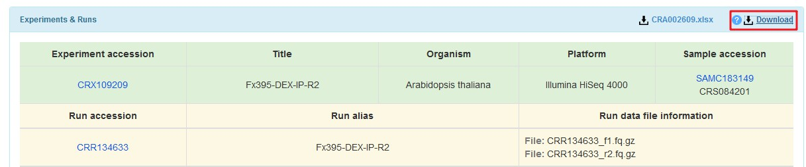

# 2020STARProtocols_pipeline

## Table of contents

- [DownloadFile](#DownloadFile)
- [Preprocessing_and_QC](#Preprocessing_and_QC)
- [Align_and_Convert](#Align_and_Convert)
- [Filter](#Filter)
- [CallPeak](#CallPeak)
- [Normalize_and_QC](#Normalize_and_QC)

## DownloadFile

[PRJCA002620_GSA](https://bigd.big.ac.cn/gsa/browse/CRA002609) and 

| CRR134566 | WT-E5-0h-R1_ATAC |
| --------- | ---------------- |
| CRR134567 | WT-E5-0h-R2_ATAC |
| CRR134582 | WT-G3-R1_ATAC    |
| CRR134583 | WT-G3-R2_ATAC    |

## Preprocessing_and_QC

## Align_and_Convert

## Filter

## CallPeak

## Normalize_and_QC

