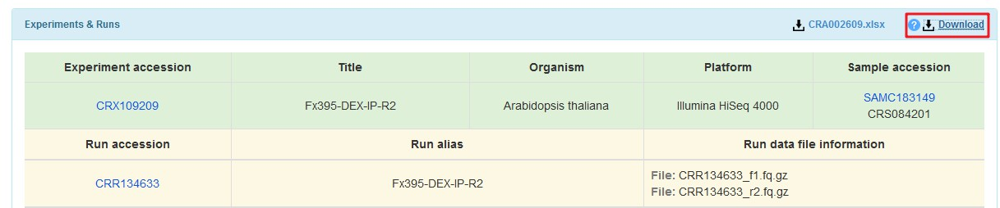

# UpStreamAnalysis

This is the UpStreamAnalysis script of 2020STARProtocols_pipeline. It will be divided into several parts, including DownloadFile, Preprocessing and QC, Align, Filter, CallPeak and so on. And each part will be further divided into several sections:

- Program (The tools used in this part, I will also post the Tools version, like fastp  v0.20.0)
- Description
- PseudoCode (The main code in this part, It will help people to know the main function of this part)
- Sciprt (I will post the link of script I used or I just show the script)
- Note (I will talk some tips when analysising this part)


> Please noticed that the script used here are just shell sciprt, which means I may not guarantee that your software will run smoothly. But I am sure you can convert this sciprt into other mode you like. And I will convert all these things into more friendly language in the future :).


## Table of contents

- [DownloadFile](#DownloadFile)
- [Preprocessing_and_QC](#Preprocessing_and_QC)
- [Align_and_Convert](#Align_and_Convert)
- [Filter](#Filter)
- [CallPeak](#CallPeak)
- [Normalize_and_QC](#Normalize_and_QC)


## DownloadFile

### Program

- wget

### Description

Although this script is the code of 2020STARProtocols, but actually the materials used (Em and G3) is from [Chromatin Accessibility Dynamics and a Hierarchical Transcriptional Regulatory Network Structure for Plant Somatic Embryogenesis](https://www.sciencedirect.com/science/article/pii/S1534580720305517?via%3Dihub). So I will use data in the [PRJCA002620_GSA](https://bigd.big.ac.cn/gsa/browse/CRA002609) as test data. 

Aftering cliking the `Download button`, you will see the whole data in the PRJCA002620 project, but we only used the WT-G3 and WT-E5-0h data in this analysis. The whole alias between Run-accession(which is the file name) and Run alias(which is the true name) can be found in the CRA002609.xlsx




### Sciprt

At first, we can prepare a directory named `2020STARProtocols_ATAC_Seq_202010`, and then create a directory named `rawdata` inside it.

```bash
$ mkdir -p 2020STARProtocols_ATAC_Seq_202010/rawdata

# please do not put other things in 2020STARProtocols_ATAC_Seq_202010, just prepare a empty rawdata folder
$ tree 2020STARProtocols_ATAC_Seq_202010/
2020STARProtocols_ATAC_Seq_202010/
└── rawdata

1 directory, 0 files

```

> If you want to try the scipt I run, you have to prepare the origin structure like above.

And then we prepare a downinfo file to download the fastq file we needed.

> For DownloadInfo, you can also use the [DownloadInfo.txt](../File/DownloadInfo.txt) I prepare.

```bash
# you can make this file by yourself
sgd@localhost ~/project/202010/2020STARProtocols_ATAC_Seq_202010/rawdata
$ cat DownloadInfo.txt 
CRR134566	WT-E5-0h-R1_ATAC
CRR134567	WT-E5-0h-R2_ATAC
CRR134582	WT-G3-R1_ATAC
CRR134583	WT-G3-R2_ATAC

# download f1.fq.gz(The R1 in PE sequence)
sgd@localhost ~/project/202010/2020STARProtocols_ATAC_Seq_202010/rawdata
$ cut -f 1 DownloadInfo.txt | xargs -I {} echo ftp://download.big.ac.cn/gsa3/CRA002609/{}/{}_f1.fq.gz | xargs -n 1 wget

# download r2.fq.gz(The R2 in PE sequence)
sgd@localhost ~/project/202010/2020STARProtocols_ATAC_Seq_202010/rawdata
$ cut -f 1 DownloadInfo.txt | xargs -I {} echo ftp://download.big.ac.cn/gsa3/CRA002609/{}/{}_r2.fq.gz | xargs -n 1 wget
```

After downloading the R1 and R2, we then can check the md5 value and rename files.

> For md5sum, you can also use the [md5sum.txt](../File/md5sum.txt) I download

```bash
# download md5sum file
sgd@localhost ~/project/202010/2020STARProtocols_ATAC_Seq_202010/rawdata
$ wget ftp://download.big.ac.cn/gsa3/CRA002609/md5sum.txt

sgd@localhost ~/project/202010
$ tree 2020STARProtocols_ATAC_Seq_202010/
2020STARProtocols_ATAC_Seq_202010/
└── rawdata
	├── CRR134566_f1.fq.gz
	├── CRR134566_r2.fq.gz
	├── CRR134567_f1.fq.gz
	├── CRR134567_r2.fq.gz
	├── CRR134582_f1.fq.gz
	├── CRR134582_r2.fq.gz
	├── CRR134583_f1.fq.gz
	├── CRR134583_r2.fq.gz
	├── DownloadInfo.txt
	└── md5sum.txt

1 directory, 10 files

# md5sum check
sgd@localhost ~/project/202010/2020STARProtocols_ATAC_Seq_202010/rawdata
$ ls *.gz | xargs -I {} grep {} md5sum.txt | sed -E 's/\/CRA002609\/CRR[0-9]{6}\///g' | md5sum -c 
CRR134566_f1.fq.gz: OK
CRR134566_r2.fq.gz: OK
CRR134567_f1.fq.gz: OK
CRR134567_r2.fq.gz: OK
CRR134582_f1.fq.gz: OK
CRR134582_r2.fq.gz: OK
CRR134583_f1.fq.gz: OK
CRR134583_r2.fq.gz: OK

# rename file
sgd@localhost ~/project/202010/2020STARProtocols_ATAC_Seq_202010/rawdata
$ cat DownloadInfo.txt | sed 's/\t/_f1.fq.gz /' | sed 's/_ATAC/_1.fq.gz/' | xargs -n2 mv
$ cat DownloadInfo.txt | sed 's/\t/_r2.fq.gz /' | sed 's/_ATAC/_2.fq.gz/' | xargs -n2 mv

sgd@localhost ~/project/202010/2020STARProtocols_ATAC_Seq_202010/rawdata
$ ll
total 16G
-rw-r--r--. 1 sgd bioinfo  102 Oct 21 17:22 DownloadInfo.txt
-rw-r--r--. 1 sgd bioinfo  15K Oct 21 17:38 md5sum.txt
-rw-r--r--. 1 sgd bioinfo 2.2G Oct 21 17:42 WT-E5-0h-R1_1.fq.gz
-rw-r--r--. 1 sgd bioinfo 2.2G Oct 21 17:43 WT-E5-0h-R1_2.fq.gz
-rw-r--r--. 1 sgd bioinfo 1.9G Oct 21 17:51 WT-E5-0h-R2_1.fq.gz
-rw-r--r--. 1 sgd bioinfo 1.9G Oct 21 17:47 WT-E5-0h-R2_2.fq.gz
-rw-r--r--. 1 sgd bioinfo 1.8G Oct 21 17:56 WT-G3-R1_1.fq.gz
-rw-r--r--. 1 sgd bioinfo 1.8G Oct 21 17:52 WT-G3-R1_2.fq.gz
-rw-r--r--. 1 sgd bioinfo 1.9G Oct 21 18:00 WT-G3-R2_1.fq.gz
-rw-r--r--. 1 sgd bioinfo 1.9G Oct 21 17:56 WT-G3-R2_2.fq.gz


```


After preparing the rawdata, you can prepare the all Uscript 


## Preprocessing_and_QC

**Program**

- fastp  v0.20.0
- 

Input

- Downloaded fastq: $prefix_1.fq.gz, \$prefix_2.fq.gz

Ouput

- Trimmed fastq: $prefix_1.clean.fq.gz, \$prefix_2.clean.fq.gz

- 


```bash
fastp \
-a CTGTCTCTTATACACATCT \
-i ${id}_1.fq.gz \
-I ${id}_2.fq.gz \
-o ${cleandata_out}/${base}_1.clean.fq.gz \
-O ${cleandata_out}/${base}_2.clean.fq.gz \
-j ${fastp_log}/${base}.fastp.json \
-h ${fastp_log}/${base}.fastp.html \
2> ${fastp_log}/${base}.logs
```


> Note: For ATAC-Seq, I prefer to add the paramter `-a CTGTCTCTTATACACATCT`, which is the Tn5 adapter.


```bash
$ nohup ./ATAC_Seq_01_QC.sh ~/project/202010/2020STARProtocols_ATAC_Seq_202010 >> ~/project/202010/2020STARProtocols_ATAC_Seq_202010/log_file 2>&1 &
```


## Align_and_Convert


## Filter


## CallPeak


## Normalize_and_QC

