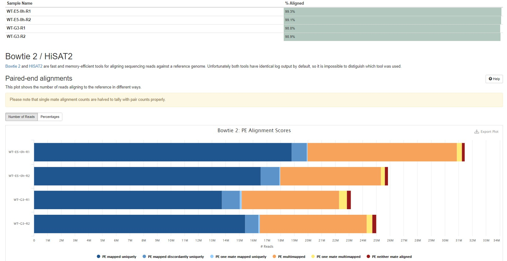

# UpStreamAnalysis

This is the UpStreamAnalysis script of 2020STARProtocols_pipeline. It will be divided into several parts, including DownloadFile, Preprocessing and QC, Align, Filter, CallPeak and so on. And each part will be further divided into several sections:

- Program (The tools used in this part, I will also post the Tools version, like fastp  v0.20.0)
- Description (I will explain what I will do next and show the specific command and result )
- PseudoCode (The main code in this part, It will help people to know the main function of this part)
- Note (I will talk some tips when analysising this part)


> Please noticed that the script used here are just shell sciprt, which means I may not guarantee that your software will run smoothly. But I am sure you can convert this sciprt into other mode you like. And I will convert all these things into more friendly language in the future :).

> Please noticed taht this script is a home-made script, which means it may be suitable for Arabidopsis thaliana.

> you can access all scripts used in this analysis in this [link](./Script). I prefer to put all script into a directory named script
>
> ```bash
> # if you just want the whole script file in this repository
> # you can try svn
> 
> sgd@localhost ~/project/202010
> $ svn checkout https://github.com/WangLab-SIPPE/2020STARProtocols_pipeline/trunk/UpStreamAnalysis/Script
> A    Script/ATAC_Seq_01_QC.sh
> A    Script/ATAC_Seq_02_align.sh
> A    Script/ATAC_Seq_03_callpeak.sh
> A    Script/ATAC_Seq_03a_naiveOverlap_NarrowPeak_manual.sh
> A    Script/ATAC_Seq_04_bamtobw.sh
> A    Script/ATAC_Seq_05_deeptools_plot.sh
> A    Script/filter.bed
> Checked out revision 6.
> 
> sgd@localhost ~/project/202010
> $ tree Script/
> Script/
> ├── ATAC_Seq_01_QC.sh
> ├── ATAC_Seq_02_align.sh
> ├── ATAC_Seq_03a_naiveOverlap_NarrowPeak_manual.sh
> ├── ATAC_Seq_03_callpeak.sh
> ├── ATAC_Seq_04_bamtobw.sh
> ├── ATAC_Seq_05_deeptools_plot.sh
> └── filter.bed
> 
> 0 directories, 7 files
> 
> sgd@localhost ~/project/202010/Script
> $ chmod 755 *.sh
> 
> sgd@localhost ~/project/202010/Script
> $ ll
> total 28K
> -rwxr-xr-x. 1 sgd bioinfo 1.8K Oct 23 10:54 ATAC_Seq_01_QC.sh
> -rwxr-xr-x. 1 sgd bioinfo 3.5K Oct 23 10:18 ATAC_Seq_02_align.sh
> -rwxr-xr-x. 1 sgd bioinfo  923 Oct 23 10:18 ATAC_Seq_03a_naiveOverlap_NarrowPeak_manual.sh
> -rwxr-xr-x. 1 sgd bioinfo 1.2K Oct 23 10:18 ATAC_Seq_03_callpeak.sh
> -rwxr-xr-x. 1 sgd bioinfo  771 Oct 23 10:18 ATAC_Seq_04_bamtobw.sh
> -rwxr-xr-x. 1 sgd bioinfo 2.6K Oct 23 10:18 ATAC_Seq_05_deeptools_plot.sh
> -rw-r--r--. 1 sgd bioinfo   28 Oct 23 10:18 filter.bed
> ```
>
> 


## Table of contents

- [DownloadFile](#DownloadFile)
- [Preprocessing_and_QC](#Preprocessing_and_QC)
- [Align_and_Convert_and_Filter](#Align_and_Convert_and_Filter)
- [CallPeak](#CallPeak)
- [Normalize_and_QC](#Normalize_and_QC)


## DownloadFile

### Program

- wget

### Description

Although this script is the code of 2020STARProtocols, but actually the materials used (Em and G3) is from [Chromatin Accessibility Dynamics and a Hierarchical Transcriptional Regulatory Network Structure for Plant Somatic Embryogenesis](https://www.sciencedirect.com/science/article/pii/S1534580720305517?via%3Dihub). So I will use data in the [PRJCA002620_GSA](https://bigd.big.ac.cn/gsa/browse/CRA002609) as test data. 

Aftering cliking the `Download button`, you will see the whole data in the PRJCA002620 project, but we only used the WT-G3 and WT-E5-0h data in this analysis. The whole alias between Run-accession(which is the file name) and Run alias(which is the true name) can be found in the CRA002609.xlsx


At first, we can prepare a directory named `2020STARProtocols_ATAC_Seq_202010`, and then create a directory named `rawdata` inside it.

```bash
$ mkdir -p 2020STARProtocols_ATAC_Seq_202010/rawdata

# please do not put other things in 2020STARProtocols_ATAC_Seq_202010, just prepare a empty rawdata folder
$ tree 2020STARProtocols_ATAC_Seq_202010/
2020STARProtocols_ATAC_Seq_202010/
└── rawdata

1 directory, 0 files

```

> If you want to try the scipt I run, you have to prepare the origin structure like above.

And then we prepare a downinfo file to download the fastq file we needed.

> For DownloadInfo, you can also use the [DownloadInfo.txt](../File/DownloadInfo.txt) I prepare.

```bash
# you can make this file by yourself
sgd@localhost ~/project/202010/2020STARProtocols_ATAC_Seq_202010/rawdata
$ cat DownloadInfo.txt 
CRR134566	WT-E5-0h-R1_ATAC
CRR134567	WT-E5-0h-R2_ATAC
CRR134582	WT-G3-R1_ATAC
CRR134583	WT-G3-R2_ATAC

# download f1.fq.gz(The R1 in PE sequence)
sgd@localhost ~/project/202010/2020STARProtocols_ATAC_Seq_202010/rawdata
$ cut -f 1 DownloadInfo.txt | xargs -I {} echo ftp://download.big.ac.cn/gsa3/CRA002609/{}/{}_f1.fq.gz | xargs -n 1 wget

# download r2.fq.gz(The R2 in PE sequence)
sgd@localhost ~/project/202010/2020STARProtocols_ATAC_Seq_202010/rawdata
$ cut -f 1 DownloadInfo.txt | xargs -I {} echo ftp://download.big.ac.cn/gsa3/CRA002609/{}/{}_r2.fq.gz | xargs -n 1 wget
```

After downloading the R1 and R2, we then can check the md5 value and rename files.

> For md5sum, you can also use the [md5sum.txt](../File/md5sum.txt) I download.

```bash
# download md5sum file
sgd@localhost ~/project/202010/2020STARProtocols_ATAC_Seq_202010/rawdata
$ wget ftp://download.big.ac.cn/gsa3/CRA002609/md5sum.txt

sgd@localhost ~/project/202010
$ tree 2020STARProtocols_ATAC_Seq_202010/
2020STARProtocols_ATAC_Seq_202010/
└── rawdata
	├── CRR134566_f1.fq.gz
	├── CRR134566_r2.fq.gz
	├── CRR134567_f1.fq.gz
	├── CRR134567_r2.fq.gz
	├── CRR134582_f1.fq.gz
	├── CRR134582_r2.fq.gz
	├── CRR134583_f1.fq.gz
	├── CRR134583_r2.fq.gz
	├── DownloadInfo.txt
	└── md5sum.txt

1 directory, 10 files

# md5sum check
sgd@localhost ~/project/202010/2020STARProtocols_ATAC_Seq_202010/rawdata
$ ls *.gz | xargs -I {} grep {} md5sum.txt | sed -E 's/\/CRA002609\/CRR[0-9]{6}\///g' | md5sum -c 
CRR134566_f1.fq.gz: OK
CRR134566_r2.fq.gz: OK
CRR134567_f1.fq.gz: OK
CRR134567_r2.fq.gz: OK
CRR134582_f1.fq.gz: OK
CRR134582_r2.fq.gz: OK
CRR134583_f1.fq.gz: OK
CRR134583_r2.fq.gz: OK

# rename file
sgd@localhost ~/project/202010/2020STARProtocols_ATAC_Seq_202010/rawdata
$ cat DownloadInfo.txt | sed 's/\t/_f1.fq.gz /' | sed 's/_ATAC/_1.fq.gz/' | xargs -n2 mv
$ cat DownloadInfo.txt | sed 's/\t/_r2.fq.gz /' | sed 's/_ATAC/_2.fq.gz/' | xargs -n2 mv

sgd@localhost ~/project/202010/2020STARProtocols_ATAC_Seq_202010/rawdata
$ ll
total 16G
-rw-r--r--. 1 sgd bioinfo  102 Oct 21 17:22 DownloadInfo.txt
-rw-r--r--. 1 sgd bioinfo  15K Oct 21 17:38 md5sum.txt
-rw-r--r--. 1 sgd bioinfo 2.2G Oct 21 17:42 WT-E5-0h-R1_1.fq.gz
-rw-r--r--. 1 sgd bioinfo 2.2G Oct 21 17:43 WT-E5-0h-R1_2.fq.gz
-rw-r--r--. 1 sgd bioinfo 1.9G Oct 21 17:51 WT-E5-0h-R2_1.fq.gz
-rw-r--r--. 1 sgd bioinfo 1.9G Oct 21 17:47 WT-E5-0h-R2_2.fq.gz
-rw-r--r--. 1 sgd bioinfo 1.8G Oct 21 17:56 WT-G3-R1_1.fq.gz
-rw-r--r--. 1 sgd bioinfo 1.8G Oct 21 17:52 WT-G3-R1_2.fq.gz
-rw-r--r--. 1 sgd bioinfo 1.9G Oct 21 18:00 WT-G3-R2_1.fq.gz
-rw-r--r--. 1 sgd bioinfo 1.9G Oct 21 17:56 WT-G3-R2_2.fq.gz

```


## Preprocessing_and_QC

### Program

- fastp  v0.20.0
- FastQC 0.11.7
- multiqc 1.8


### Description

In this part, I will use the `fastp` to cut adpater, remove low quality reads and then use the `FastQC` to see the quality of reads, `mutliqc` to tidy the whole QC result.

```bash
sgd@localhost ~/project/202010/Script
$ nohup ./ATAC_Seq_01_QC.sh ~/project/202010/2020STARProtocols_ATAC_Seq_202010 >> ~/project/202010/2020STARProtocols_ATAC_Seq_202010/log_file 2>&1 &
```

Then you will see the something more in `2020STARProtocols_ATAC_Seq_202010`  directory

```bash
sgd@localhost ~/project/202010/2020STARProtocols_ATAC_Seq_202010
$ tree -L 1
.
├── log_file	# the command log
├── logs	# the specific tools log
├── rawdata	# the rawdata
├── result	# the result
└── tmp	# tmp result

4 directories, 1 file
```

> In the next part, I will hide all this info so you can see this yourself

```bash
sgd@localhost ~/project/202010/2020STARProtocols_ATAC_Seq_202010
$ cat log_file 
nohup: ignoring input
everything is OK. Let's do it
your work_path: /home/sgd/project/202010/2020STARProtocols_ATAC_Seq_202010
fastp begins
Sample name is WT-E5-0h-R1
Sample WT-E5-0h-R1 is done
Sample name is WT-E5-0h-R2
Sample WT-E5-0h-R2 is done
Sample name is WT-G3-R1
Sample WT-G3-R1 is done
Sample name is WT-G3-R2
Sample WT-G3-R2 is done
fastp ends
[WARNING]         multiqc : MultiQC Version v1.9 now available!
[INFO   ]         multiqc : This is MultiQC v1.8
[INFO   ]         multiqc : Template    : default
[INFO   ]         multiqc : Searching   : /home/sgd/project/202010/2020STARProtocols_ATAC_Seq_202010/logs/fastqc_v1
[INFO   ]          fastqc : Found 8 reports
[INFO   ]         multiqc : Compressing plot data
[INFO   ]         multiqc : Report      : ../../../project/202010/2020STARProtocols_ATAC_Seq_202010/logs/fastqc_v1/multiqc_report.html
[INFO   ]         multiqc : Data        : ../../../project/202010/2020STARProtocols_ATAC_Seq_202010/logs/fastqc_v1/multiqc_data
[INFO   ]         multiqc : MultiQC complete
[WARNING]         multiqc : MultiQC Version v1.9 now available!
[INFO   ]         multiqc : This is MultiQC v1.8
[INFO   ]         multiqc : Template    : default
[INFO   ]         multiqc : Searching   : /home/sgd/project/202010/2020STARProtocols_ATAC_Seq_202010/logs/fastp
[INFO   ]           fastp : Found 4 reports
[INFO   ]         multiqc : Compressing plot data
[INFO   ]         multiqc : Report      : ../../../project/202010/2020STARProtocols_ATAC_Seq_202010/logs/fastp/multiqc_report.html
[INFO   ]         multiqc : Data        : ../../../project/202010/2020STARProtocols_ATAC_Seq_202010/logs/fastp/multiqc_data
[INFO   ]         multiqc : MultiQC complete

```


```bash
sgd@localhost ~/project/202010/2020STARProtocols_ATAC_Seq_202010
$ tree
.
├── log_file
├── logs
│   ├── fastp
│   │   ├── multiqc_data
│   │   │   ├── multiqc_data.json
│   │   │   ├── multiqc_fastp.txt
│   │   │   ├── multiqc_general_stats.txt
│   │   │   ├── multiqc.log
│   │   │   ├── multiqc_qualimap_bamqc_genome_results.txt
│   │   │   └── multiqc_sources.txt
│   │   ├── multiqc_report.html
│   │   ├── WT-E5-0h-R1.fastp.html
│   │   ├── WT-E5-0h-R1.fastp.json
│   │   ├── WT-E5-0h-R1.logs
│   │   ├── WT-E5-0h-R2.fastp.html
│   │   ├── WT-E5-0h-R2.fastp.json
│   │   ├── WT-E5-0h-R2.logs
│   │   ├── WT-G3-R1.fastp.html
│   │   ├── WT-G3-R1.fastp.json
│   │   ├── WT-G3-R1.logs
│   │   ├── WT-G3-R2.fastp.html
│   │   ├── WT-G3-R2.fastp.json
│   │   └── WT-G3-R2.logs
│   └── fastqc_v1
│       ├── multiqc_data
│       │   ├── multiqc_data.json
│       │   ├── multiqc_fastqc.txt
│       │   ├── multiqc_general_stats.txt
│       │   ├── multiqc.log
│       │   ├── multiqc_qualimap_bamqc_genome_results.txt
│       │   └── multiqc_sources.txt
│       ├── multiqc_report.html
│       ├── WT-E5-0h-R1_1.clean_fastqc.html
│       ├── WT-E5-0h-R1_1.clean_fastqc.zip
│       ├── WT-E5-0h-R1_2.clean_fastqc.html
│       ├── WT-E5-0h-R1_2.clean_fastqc.zip
│       ├── WT-E5-0h-R2_1.clean_fastqc.html
│       ├── WT-E5-0h-R2_1.clean_fastqc.zip
│       ├── WT-E5-0h-R2_2.clean_fastqc.html
│       ├── WT-E5-0h-R2_2.clean_fastqc.zip
│       ├── WT-G3-R1_1.clean_fastqc.html
│       ├── WT-G3-R1_1.clean_fastqc.zip
│       ├── WT-G3-R1_2.clean_fastqc.html
│       ├── WT-G3-R1_2.clean_fastqc.zip
│       ├── WT-G3-R2_1.clean_fastqc.html
│       ├── WT-G3-R2_1.clean_fastqc.zip
│       ├── WT-G3-R2_2.clean_fastqc.html
│       └── WT-G3-R2_2.clean_fastqc.zip
├── rawdata
│   ├── DownloadInfo.txt
│   ├── md5sum.txt
│   ├── WT-E5-0h-R1_1.fq.gz
│   ├── WT-E5-0h-R1_2.fq.gz
│   ├── WT-E5-0h-R2_1.fq.gz
│   ├── WT-E5-0h-R2_2.fq.gz
│   ├── WT-G3-R1_1.fq.gz
│   ├── WT-G3-R1_2.fq.gz
│   ├── WT-G3-R2_1.fq.gz
│   └── WT-G3-R2_2.fq.gz
├── result
│   └── 01_cleandata
│       ├── WT-E5-0h-R1_1.clean.fq.gz
│       ├── WT-E5-0h-R1_2.clean.fq.gz
│       ├── WT-E5-0h-R2_1.clean.fq.gz
│       ├── WT-E5-0h-R2_2.clean.fq.gz
│       ├── WT-G3-R1_1.clean.fq.gz
│       ├── WT-G3-R1_2.clean.fq.gz
│       ├── WT-G3-R2_1.clean.fq.gz
│       └── WT-G3-R2_2.clean.fq.gz
└── tmp
    └── sample_for_QC.txt

9 directories, 62 files
```

We can also see the mutliqc result in `2020STARProtocols_ATAC_Seq_202010/logs/fastqc_v1/multiqc_report.html`


### PseudoCode

- Input
  - **rawdata:** \${prefix}\_1.fq.gz, ${prefix}_2.fq.gz
- output
  - **cleandata:** \${prefix}\_1.clean.fq.gz, ${prefix}_2.clean.fq.gz
  - **fastplog**: \${prefix}.fastp.json, ${prefix}.fastp.html
  - **FastQCresult** 
  - **multiqcresult**

```bash
fastp \
-a CTGTCTCTTATACACATCT \
-i ${prefix}_1.fq.gz \
-I ${prefix}_2.fq.gz \
-o ${prefix}_1.clean.fq.gz \
-O ${prefix}_2.clean.fq.gz \
-j ${prefix}.fastp.json \
-h ${prefix}.fastp.html

fastqc -q -t 20 clean.fq.gz -o FastQCresult

multiqc -o FastQCresult multiqcresult
```


### Note

- For ATAC-Seq, I prefer to add the paramter `-a CTGTCTCTTATACACATCT` when I running fastp. `CTGTCTCTTATACACATCT` is the Tn5 adapter. I found if drop this adapter, there will be much adapter sequence in the FastQC result
- For the Arabidopsis thaliana ATAC-Seq, PE150 *  20M reads may be enough if you library is good. 

> For ENCODE human ATAC Standards, 25M non-duplicate, non-mitochondrial aligned fragments for 3G genome. So For about 100M genome, 25/30 = 1M fragments are enough. And 20M * 90%(alignment rate) * 50%(duplicated reads) * 50%(PE mapped uniquely) * 50%(remove organelle) = 2.25 is OK.


## Align_and_Convert_and_Filter

### Program

- Bowtie2 v2.3.4.3 
- Samtools v1.9
- sambamba v0.6.7
- bedtools v2.25.0 
- multiqc 1.8

### Description

In this part, we will align the trimmed reads to the TAIR10 genome using `Bowtie2`. Then the mapped reads will be converted into BAM format, sorted, indexed using `Samtools`. We then use the `sambamba` , `Samtools` , `bedtools` to mark, remove low-quailty, duplicated, organellar mapped reads.

```bash
sgd@localhost ~/project/202010/Script
$ nohup ./ATAC_Seq_02_align.sh ~/project/202010/2020STARProtocols_ATAC_Seq_202010 >> ~/project/202010/2020STARProtocols_ATAC_Seq_202010/log_file 2>&1
```

Then you will see the logs and alignmentd file in separate directories

```bash
sgd@localhost ~/project/202010/2020STARProtocols_ATAC_Seq_202010
$ tree -L 1 logs
logs
├── bowtie2_alignment
├── fastp
├── fastqc_v1
└── sambamba_markdup

sgd@localhost ~/project/202010/2020STARProtocols_ATAC_Seq_202010
$ tree -L 1 result/
result/
├── 01_cleandata
├── 02_alignment # Raw mapped reads
└── 03_filter_alignment # filtered mapped reads
```

We can see the bowtie2 logs in multiqc structure in the `2020STARProtocols_ATAC_Seq_202010/logs/bowtie2_alignment/multiqc_report.html`



And we can use the samtools to see the difference between raw bam and filter bam

```bash
# Before filter
sgd@localhost ~/project/202010/2020STARProtocols_ATAC_Seq_202010/result/02_alignment
$ samtools flagstat -@ 10 WT-E5-0h-R1.sorted.bam
62903320 + 0 in total (QC-passed reads + QC-failed reads)
0 + 0 secondary
0 + 0 supplementary
0 + 0 duplicates
62491628 + 0 mapped (99.35% : N/A)
62903320 + 0 paired in sequencing
31451660 + 0 read1
31451660 + 0 read2
59420334 + 0 properly paired (94.46% : N/A)
62414068 + 0 with itself and mate mapped
77560 + 0 singletons (0.12% : N/A)
178208 + 0 with mate mapped to a different chr
45806 + 0 with mate mapped to a different chr (mapQ>=5)


sgd@localhost ~/project/202010/2020STARProtocols_ATAC_Seq_202010/result/02_alignment
$ samtools idxstats WT-E5-0h-R1.sorted.bam
Chr1	30427671	7632907	12314
Chr2	19698289	9812027	12513
Chr3	23459830	6547802	11304
Chr4	18585056	4803005	7891
Chr5	26975502	6735431	10922
ChrM	366924	7827281	7311
ChrC	154478	19133175	15305
*	0	0	334132


--------------------------------------------------------------------------------------
# After filter
sgd@localhost ~/project/202010/2020STARProtocols_ATAC_Seq_202010/result/03_filter_alignment
$ samtools flagstat -@ 10 WT-E5-0h-R1.rm_organelle.bam
22137097 + 0 in total (QC-passed reads + QC-failed reads)
0 + 0 secondary
0 + 0 supplementary
0 + 0 duplicates
22137097 + 0 mapped (100.00% : N/A)
22137097 + 0 paired in sequencing
11074252 + 0 read1
11062845 + 0 read2
20423402 + 0 properly paired (92.26% : N/A)
22137097 + 0 with itself and mate mapped
0 + 0 singletons (0.00% : N/A)
9246 + 0 with mate mapped to a different chr
9246 + 0 with mate mapped to a different chr (mapQ>=5)

sgd@localhost ~/project/202010/2020STARProtocols_ATAC_Seq_202010/result/03_filter_alignment
$ samtools idxstats WT-E5-0h-R1.rm_organelle.bam
Chr1	30427671	5712098	0
Chr2	19698289	3764959	0
Chr3	23459830	4299979	0
Chr4	18585056	3420802	0
Chr5	26975502	4939259	0
ChrM	366924	0	0
ChrC	154478	0	0
*	0	0	0

```


### PseudoCode

- Input
  - **cleandata:** \${prefix}\_1.clean.fq.gz, ${prefix}_2.clean.fq.gz
  - **The bed file of region which needs to be removed:** filter.bed
  - **TIAR 10 index:** ${index}
- Output:
  - **Raw BAM file:** ${prefix}.sorted.bam
  - **Filtered BAM file**: ${prefix}.rm_organelle.bam
  - **multiqcresult**

```bash
# bowtie2 alignment & samtools sort & samtools convert into bam 
bowtie2 -x ${index} \
-1 ${prefix}_1.clean.fq.gz \
-2 ${prefix}_2.clean.fq.gz 2> ${prefix}.log \
| samtools sort -@ 20 -O bam -o ${prefix}.sorted.bam -
# samtools index bam 
samtools index ${prefix}.sorted.bam

# sambamba mark the duplicated reads
sambamba markdup ${prefix}.sorted.bam ${prefix}.sorted.markdup.bam 2> ${prefix}.log

# remove low-quality mapped and duplicated reads
samtools view -@ 20 -bF 1804 -q 20 ${prefix}.sorted.markdup.bam -o ${prefix}.flt.bam
samtools index -@ 20 ${prefix}.flt.bam

# bedtools remove ChrC and ChrM reads
bedtools intersect -abam ${prefix}.flt.bam -b filter.bed -v > ${prefix}.rm_organelle.bam
samtools index ${prefix}.rm_organelle.bam

```


### Note

- 


## CallPeak


## Normalize_and_QC

